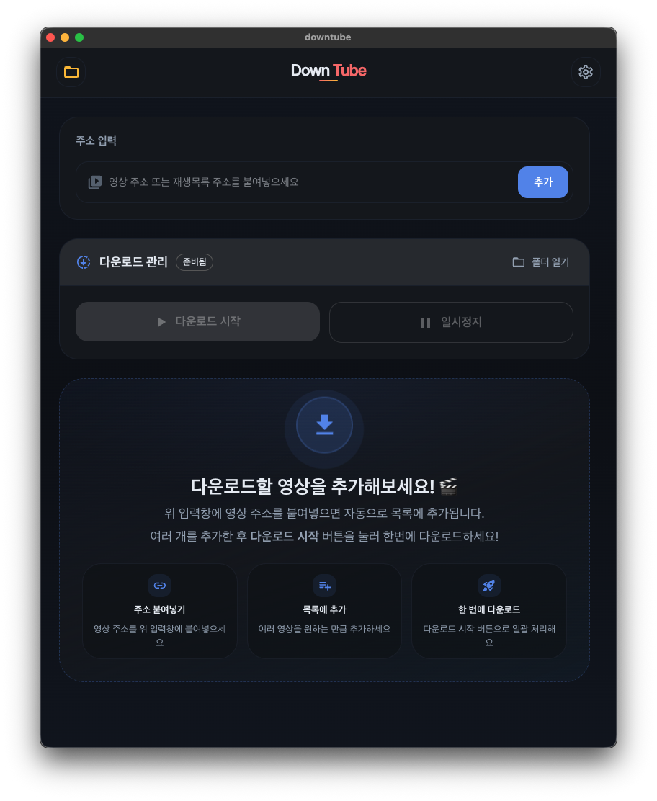

[English](./README.md)

# Downtube

<p align="center">
  
</p>

<p align="center">
  <a href="./LICENSE"></a>
  
  
  
</p>

Downtube는 큐 기반 미디어 다운로드, 완료 항목 보관함, 로컬 재생, Windows 인앱 업데이트를 제공하는 개인용 Electron 데스크톱 앱입니다.

> 이 프로젝트는 직접 소유한 콘텐츠, 공개 라이선스 콘텐츠, 또는 사용 권한이 있는 콘텐츠를 대상으로 사용하는 것을 전제로 합니다.

## 목차

- [주요 기능](#주요-기능)
- [기술 스택](#기술-스택)
- [요구사항](#요구사항)
- [시작하기](#시작하기)
- [빌드 및 패키징](#빌드-및-패키징)
- [Windows 업데이트 흐름](#windows-업데이트-흐름)
- [설정 및 언어 처리](#설정-및-언어-처리)
- [프로젝트 구조](#프로젝트-구조)
- [주요 IPC 채널](#주요-ipc-채널)
- [보안 메모](#보안-메모)
- [개발 메모](#개발-메모)
- [라이선스](#라이선스)
- [사용 및 배포 안내](#사용-및-배포-안내)
- [기여](#기여)

## 주요 기능

- 비디오와 오디오 다운로드를 같은 큐에서 관리
- 플레이리스트 URL 파싱 후 일괄 큐 추가와 플레이리스트 개수 제한 지원
- 다운로드 시작, 일시정지, 중단, 제거, 재시도, 대기 중 작업 타입 전환 지원
- 최근 URL 기록 저장
- 완료 항목 보관함에서 열기, 위치 열기, 삭제, 썸네일, sidecar 메타데이터 재사용 지원
- 로컬 비디오/오디오 재생용 내장 플레이어
- 탐색, 볼륨, 음소거, 재생 속도, 전체화면, 오디오 시각화, ambient particles 컨트롤
- 테마 모드, 테마 스타일, 언어, 기본 다운로드 타입, 플레이리스트 제한 설정
- 한국어/영어 UI와 `system` 언어 설정 지원
- 시작 시 번들 도구 점검과 필요 시 Windows/macOS용 `yt-dlp` 런타임 다운로드
- Windows용 업데이트 확인, 다운로드, 압축 해제, 재시작 적용 흐름 제공

## 기술 스택

| 분류            | 기술                                   |
| --------------- | -------------------------------------- |
| 데스크톱 런타임 | Electron, electron-vite                |
| Renderer        | React 19, React Router, TypeScript     |
| UI              | MUI, Emotion                           |
| 상태 관리       | Zustand                                |
| 다국어          | i18next, react-i18next                 |
| 미디어 도구     | yt-dlp, FFmpeg, ffprobe, fluent-ffmpeg |
| 설정 저장       | electron-store                         |
| 빌드            | electron-builder, esbuild, pkg         |

## 요구사항

- Node.js
- pnpm
- 현재 유지 중인 패키징 스크립트를 쓰려면 Windows 또는 macOS
- Git Bash, WSL 같은 환경에서 `pnpm build:win`을 실행하려면 `powershell.exe`
- `pnpm release:win`을 쓰려면 `gh` CLI

메모:

- 현재 renderer 입력 검증은 YouTube 비디오/플레이리스트 URL 기준으로 동작합니다.
- 유지 중인 릴리즈/업데이트 흐름은 Windows 우선입니다.
- electron-builder 설정의 진실 소스는 `package.json`의 `build` 필드입니다.

## 시작하기

```bash
git clone <your-repository-url>
cd downtube
pnpm install
pnpm dev
```

자주 쓰는 명령:

```bash
pnpm typecheck
pnpm lint
pnpm format
pnpm clean
pnpm tools:ensure
pnpm build
pnpm build:helper
pnpm build:win
pnpm build:mac
```

## 빌드 및 패키징

### 앱 빌드

```bash
pnpm build
```

실행 순서:

- `scripts/build-tools/ensure-tools.sh`
- `pnpm typecheck`
- `electron-vite build`

### helper 빌드

```bash
pnpm build:helper
```

`src/update-helper/index.ts`를 esbuild로 번들링하고, `pkg`로 `out/update-helper/update-helper.exe`를 만듭니다.

### Windows 패키지

```bash
pnpm build:win
```

수행 내용:

- `dist/`, `out/` 정리
- `--frozen-lockfile` 기준 의존성 재설치
- 일반 앱 빌드 실행
- `update-helper.exe` 빌드
- electron-builder로 Windows unpacked 결과물 생성
- `resources/update-helper/update-helper.exe` 포함 여부 검증
- `dist/win-unpacked`를 `releases/` 아래 zip으로 압축
- 성공 시 unpacked 결과물 폴더 열기

### macOS 패키지

```bash
pnpm build:mac
```

수행 내용:

- `dist/`, `out/` 정리
- `--frozen-lockfile` 기준 의존성 재설치
- 일반 앱 빌드 실행
- electron-builder로 macOS arm64 번들 생성
- 로컬 실행용 ad-hoc 서명 적용

### Windows 릴리즈 초안

```bash
pnpm release:win
```

이 스크립트는 아래 상태를 전제로 합니다.

- git working tree가 깨끗할 것
- 현재 브랜치가 원격에 푸시되어 있을 것
- `gh` CLI가 설치되어 있고 인증되어 있을 것

실행하면 Windows 아티팩트를 빌드한 뒤 GitHub draft release를 생성하거나 갱신합니다.

## Windows 업데이트 흐름

Downtube는 설정 화면에서 사용할 수 있는 Windows 인앱 업데이트 흐름을 포함합니다.

상위 흐름:

- `app:check-for-updates`로 GitHub 릴리즈 메타데이터 확인
- `app:download-update`로 Windows portable zip 다운로드
- 버전별 update cache 디렉터리에 압축 해제
- `app:apply-update`로 apply plan 생성 후 `update-helper.exe`를 version cache로 복사
- helper가 앱 종료를 기다린 뒤 설치 파일 교체
- 교체 후 새 실행 파일 재시작
- 다음 앱 부팅 때 update cache의 helper/apply 산출물 정리

범위 메모:

- 업데이트 다운로드와 적용은 현재 Windows 전용입니다.
- helper 관련 계약 타입과 준비 로직은 `src/main/updates` 아래에 둡니다.
- 패키징된 앱은 `package.json`의 `build.extraResources` 설정으로 `resources/update-helper/update-helper.exe`를 포함합니다.

## 설정 및 언어 처리

저장 설정은 `electron-store`를 통해 저장되며 main process에서 검증됩니다.

| 설정 항목                   | 값                                          |
| --------------------------- | ------------------------------------------- |
| 앱 언어                     | `system`, `ko`, `en`                        |
| 앱 테마                     | `system`, `light`, `dark`                   |
| 앱 테마 스타일              | `default`, `slate`, `ink`, `jade`, `aurora` |
| 플레이어 볼륨               | —                                           |
| 플레이어 음소거 상태        | —                                           |
| 오디오 시각화 표시 여부     | —                                           |
| ambient particles 표시 여부 | —                                           |
| 기본 다운로드 타입          | `video`, `audio`                            |
| 플레이리스트 제한           | —                                           |
| 최근 URL 기록               | —                                           |

언어 처리 흐름:

- 저장값은 language preference입니다.
- 실제 적용 언어는 main process에서 resolve합니다.
- `system`이면 OS 언어를 읽어 `ko` 또는 `en`으로 정규화합니다.
- resolve된 언어를 React 렌더 전에 먼저 적용하므로 splash와 메인 UI가 같은 언어로 시작합니다.

테마 처리 흐름:

- 테마 모드와 스타일은 각각 따로 저장됩니다.
- `system` 모드는 renderer의 `prefers-color-scheme`를 따릅니다.
- `system` 모드에서는 기본 스타일을 사용합니다.
- 수동 라이트/다크 모드에서는 `default`, `slate`, `ink`, `jade`, `aurora`를 선택할 수 있습니다.

## 프로젝트 구조

```text
src
├── main
│   ├── common
│   ├── downloads
│   ├── ipc-handlers
│   ├── library
│   ├── settings
│   └── updates
│       ├── adapters
│       ├── application
│       └── shared
├── preload
├── renderer
│   └── app
│       ├── features
│       │   ├── downloads
│       │   ├── library
│       │   ├── player
│       │   ├── settings
│       │   └── splash
│       ├── pages
│       ├── shared
│       ├── styles
│       └── theme
├── types
└── update-helper
```

## 주요 IPC 채널

실제 노출 API 기준은 [`src/preload/index.ts`](./src/preload/index.ts)입니다.

| 영역         | 채널                        | 방향             | 용도                                            |
| ------------ | --------------------------- | ---------------- | ----------------------------------------------- |
| app          | `app:init`                  | renderer -> main | 시작 초기화 실행 및 진행 상태 보고              |
| app          | `app:get-runtime-info`      | renderer -> main | 버전, 플랫폼, 패키징 여부, 설치 경로 조회       |
| app          | `app:get-prepared-update`   | renderer -> main | 준비된 업데이트 캐시 상태 조회                  |
| updates      | `app:check-for-updates`     | renderer -> main | 최신 Windows 릴리즈 메타데이터 확인             |
| updates      | `app:download-update`       | renderer -> main | 업데이트 패키지 다운로드 및 압축 해제           |
| updates      | `app:apply-update`          | renderer -> main | helper 기반 적용 흐름 시작                      |
| updates      | `app:update-event`          | main -> renderer | 업데이트 진행 상태와 오류 이벤트 전달           |
| app          | `app:init-state`            | main -> renderer | 시작 초기화 진행 이벤트 전달                    |
| settings     | `settings:get`              | renderer -> main | 단일 설정 조회                                  |
| settings     | `settings:get-many`         | renderer -> main | 여러 설정 일괄 조회                             |
| settings     | `settings:set`              | renderer -> main | 검증 후 설정 저장                               |
| settings     | `settings:resolve-language` | renderer -> main | `system`, `ko`, `en` 값을 실제 적용 언어로 해석 |
| downloads    | `download-video`            | renderer -> main | 비디오 작업 추가                                |
| downloads    | `download-audio`            | renderer -> main | 오디오 작업 추가                                |
| downloads    | `download-playlist`         | renderer -> main | 플레이리스트 파싱 후 큐 추가                    |
| downloads    | `download-set-type`         | renderer -> main | 대기 중 작업 타입 변경                          |
| downloads    | `download-stop`             | renderer -> main | 대기 중 또는 실행 중 작업 중단                  |
| downloads    | `download-remove`           | renderer -> main | 실행 중이 아닌 작업 제거                        |
| downloads    | `downloads-list`            | renderer -> main | 현재 작업 목록 조회                             |
| downloads    | `downloads-start`           | renderer -> main | 큐 시작 또는 재개                               |
| downloads    | `downloads-pause`           | renderer -> main | 큐 일시정지 및 현재 작업 중단                   |
| downloads    | `downloads:event`           | main -> renderer | 큐/작업 상태 이벤트 전달                        |
| library      | `library-list`              | renderer -> main | 앱 다운로드 디렉터리 기준 완료 항목 스캔        |
| library      | `library-delete`            | renderer -> main | 미디어 파일과 관련 sidecar 삭제                 |
| player/files | `player-open`               | renderer -> main | 하나 이상의 로컬 파일로 플레이어 창 열기        |
| player/files | `download-dir-open`         | renderer -> main | 앱 다운로드 디렉터리 열기                       |
| player/files | `downloads-root-open`       | renderer -> main | 시스템 Downloads 루트 열기                      |
| player/files | `download-item-open`        | renderer -> main | 다운로드 항목 경로 열기                         |
| player/files | `file-exists`               | renderer -> main | 허용된 디렉터리 내부 파일 존재 여부 확인        |
| player/files | `media-sidecar-read`        | renderer -> main | 플레이어용 sidecar 메타데이터 읽기              |

## 보안 메모

- 메인 창은 `sandbox: true`, `contextIsolation: true`로 실행됩니다.
- renderer는 Electron/Node API에 직접 접근하지 않고 `window.api`만 사용합니다.
- IPC는 `src/main/ipc-handlers/ipc.ts`에 등록된 채널만 허용됩니다.
- 외부 링크 새 창은 차단하고 `shell.openExternal`로 시스템 브라우저에서 엽니다.
- `downtube-media://` 커스텀 프로토콜은 시스템 Downloads 디렉터리 내부 파일만 서빙하며 range request를 지원합니다.
- 플레이어 열기, sidecar 읽기, 보관함 삭제, 파일 존재 확인 같은 작업은 허용된 경로 내부인지 검증합니다.

## 개발 메모

- 앱은 hash router를 사용하고 `/splash`에서 부팅합니다.
- 개발 모드에서는 메인 창과 플레이어 창이 자동으로 DevTools를 엽니다.
- 초기화 과정에서 로그 파일은 `Downloads/DownTube/down-tube.log`에 기록됩니다.
- 앱은 다운로드 파일 옆에 미디어 sidecar(`.json`)와 썸네일 이미지를 함께 저장하고, 보관함과 플레이어에서 재사용합니다.
- 설정 화면에는 런타임 정보와 Windows 업데이트 섹션이 함께 표시됩니다.
- 패키징된 Windows 앱은 별도 `update-helper.exe`를 포함하고, 저장소에서는 그 소스를 `src/update-helper`에서 관리합니다.

## 라이선스

프로젝트 소스 코드는 [MIT License](./LICENSE)를 따릅니다.

앱에 포함되거나 함께 사용되는 외부 도구는 각자의 라이선스를 따릅니다.

| 도구    | 라이선스                                | 링크                                       |
| ------- | --------------------------------------- | ------------------------------------------ |
| yt-dlp  | Unlicense                               | [GitHub](https://github.com/yt-dlp/yt-dlp) |
| FFmpeg  | 배포 빌드에 따라 LGPL-2.1-or-later 기준 | [ffmpeg.org](https://ffmpeg.org)           |
| ffprobe | FFmpeg 배포 조건을 따름                 | [ffmpeg.org](https://ffmpeg.org)           |

## 사용 및 배포 안내

Downtube는 다운로드와 로컬 재생 기능을 제공하지만, 아래 사항은 사용자가 직접 확인해야 합니다.

- 콘텐츠에 대한 소유권 또는 사용 허가 여부
- 원본 플랫폼의 서비스 약관
- 사용 지역의 저작권 및 관련 법규

이 저장소의 스크린샷과 설명은 앱 자체를 소개하기 위한 것이며, 특정 플랫폼 콘텐츠를 자유롭게 다운로드하거나 재배포할 수 있다는 의미가 아닙니다.

## 기여

이슈와 풀 리퀘스트는 환영합니다.
변경할 때는 현재의 Electron main / preload / renderer 분리와 기존 기능 경계를 유지해 주세요.
