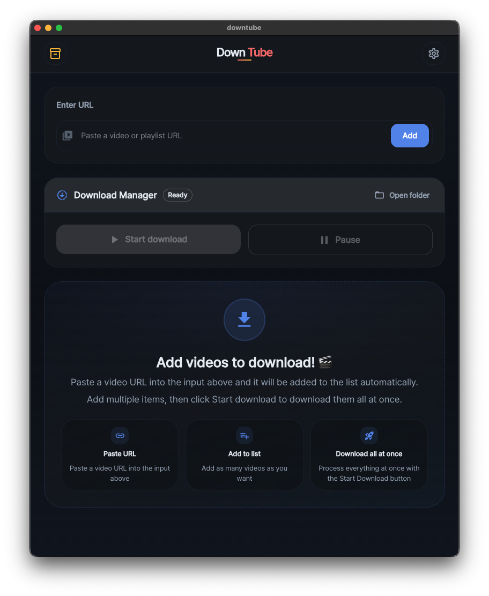

[한국어](./README.ko.md)

# Downtube

<p align="center">
  
</p>

<p align="center">
  <a href="./LICENSE"></a>
  
  
</p>

Downtube is a personal Electron desktop app for queue-based media downloads and local playback.
The current app combines a downloads screen, a completed-items library, a built-in player, localized UI, and persisted app settings.

> Use this project only for media you own, media with a public license, or media you are authorized to use.

## Table of Contents

- [Key Features](#key-features)
- [Tech Stack](#tech-stack)
- [Requirements](#requirements)
- [Getting Started](#getting-started)
- [Build and Packaging](#build-and-packaging)
- [Settings and Localization](#settings-and-localization)
- [Project Structure](#project-structure)
- [Main IPC Channels](#main-ipc-channels)
- [Security Notes](#security-notes)
- [Development Notes](#development-notes)
- [License](#license)
- [Usage and Distribution Notice](#usage-and-distribution-notice)
- [Contributing](#contributing)

---

## Key Features

- Queue-based downloads for video and audio items
- Playlist parsing and batch enqueue with a configurable playlist limit
- Queue controls for start, pause, stop, remove, and retry
- Per-job type switching while a job is still queued
- Recent URL history stored in settings
- Library view for completed downloads under the app download directory
- Built-in player for local video and audio playback
- Playback controls for seek, volume, mute, playback rate, fullscreen, and audio visualizer
- Settings for theme, language, default download type, and playlist limit
- Korean and English UI, plus a `system` language preference resolved in the main process
- Resolved language applied before the first React render, including the splash screen
- Startup checks for bundled binaries and runtime fallback download for `yt-dlp` on Windows and macOS when needed

---

## Tech Stack

| Category        | Technology                             |
| --------------- | -------------------------------------- |
| Desktop runtime | Electron, electron-vite                |
| Renderer        | React 19, React Router, TypeScript     |
| UI              | MUI, Emotion                           |
| State           | Zustand                                |
| Localization    | i18next, react-i18next                 |
| Media tools     | yt-dlp, FFmpeg, ffprobe, fluent-ffmpeg |
| Storage         | electron-store                         |
| Build           | electron-builder                       |

---

## Requirements

- Node.js
- pnpm
- Windows or macOS if you plan to use the maintained packaging scripts
- `powershell.exe` if you run `pnpm build:win` from an environment such as WSL
- `gh` CLI only if you use `pnpm release:win`

Notes:

- The app currently validates YouTube video and playlist URLs in the renderer.
- Bundled binary preparation scripts target Windows and macOS. Linux packaging is not configured in `package.json`.

---

## Getting Started

```bash
# 1. Clone the repository
git clone <your-repository-url>
cd downtube

# 2. Install dependencies
pnpm install

# 3. Run the app in development mode
pnpm dev
```

**Useful development commands**

```bash
pnpm typecheck    # type checking
pnpm lint         # lint
pnpm format       # format
pnpm clean        # clean build artifacts
pnpm tools:ensure # copy ffmpeg/ffprobe to bin/ and download yt-dlp if missing
```

---

## Build and Packaging

### App build

```bash
pnpm build
```

Runs in order: `ensure-tools.sh` → `pnpm typecheck` → `electron-vite build`

### Windows package

```bash
pnpm build:win
```

Cleans `dist/` and `out/` → reinstalls dependencies (`--frozen-lockfile`) → builds the app → creates a Windows unpacked build → zips `dist/win-unpacked` into `releases/`

### macOS package

```bash
pnpm build:mac
```

Cleans `dist/` and `out/` → reinstalls dependencies (`--frozen-lockfile`) → builds the app → packages a macOS arm64 app bundle → applies ad-hoc signing for local execution

### Windows release draft

```bash
pnpm release:win
```

This script assumes:

- a clean git working tree
- the current branch is pushed
- `gh` CLI is installed and authenticated

It builds the Windows artifact and creates or updates a draft GitHub release.

---

## Settings and Localization

Persisted settings are stored through `electron-store` and validated in the main process.

| Setting                     | Values                    |
| --------------------------- | ------------------------- |
| App language                | `system`, `ko`, `en`      |
| App theme                   | `system`, `light`, `dark` |
| Player volume               | —                         |
| Player muted state          | —                         |
| Audio visualizer visibility | —                         |
| Default download type       | `video`, `audio`          |
| Playlist limit              | —                         |
| Recent URL history          | —                         |

**Language flow**

- The stored value is a language preference.
- The effective app language is resolved in the main process.
- If the preference is `system`, the app resolves the OS language to `ko` or `en`.
- The resolved language is applied before React renders, so the splash screen and the main UI start in the same language.

**Theme flow**

- The theme preference is stored in settings.
- `system` theme follows `prefers-color-scheme` in the renderer.

---

## Project Structure

```text
src
├── main
│   ├── common
│   ├── downloads
│   ├── ipc-handlers
│   ├── library
│   └── settings
├── preload
├── renderer
│   └── app
│       ├── features
│       │   ├── downloads
│       │   ├── library
│       │   ├── player
│       │   ├── settings
│       │   └── splash
│       ├── pages
│       ├── shared
│       ├── styles
│       └── theme
└── types
```

---

## Main IPC Channels

The preload bridge in [`src/preload/index.ts`](./src/preload/index.ts) is the source of truth. The table below lists the main channels currently exposed by the app.

| Area         | Channel                     | Direction        | Purpose                                                       |
| ------------ | --------------------------- | ---------------- | ------------------------------------------------------------- |
| app          | `app:init`                  | renderer -> main | Run startup initialization and report progress                |
| settings     | `settings:get`              | renderer -> main | Read a single persisted setting                               |
| settings     | `settings:get-many`         | renderer -> main | Read multiple settings at once                                |
| settings     | `settings:set`              | renderer -> main | Save a setting after validation                               |
| settings     | `settings:resolve-language` | renderer -> main | Resolve `system`, `ko`, or `en` to the effective app language |
| downloads    | `download-video`            | renderer -> main | Add a video job                                               |
| downloads    | `download-audio`            | renderer -> main | Add an audio job                                              |
| downloads    | `download-playlist`         | renderer -> main | Parse a playlist and enqueue items                            |
| downloads    | `download-set-type`         | renderer -> main | Change the type of a queued job                               |
| downloads    | `download-stop`             | renderer -> main | Stop a queued or running job                                  |
| downloads    | `download-remove`           | renderer -> main | Remove a non-running job                                      |
| downloads    | `downloads-list`            | renderer -> main | Fetch current jobs                                            |
| downloads    | `downloads-start`           | renderer -> main | Start or resume the queue                                     |
| downloads    | `downloads-pause`           | renderer -> main | Pause the queue and stop the current job                      |
| downloads    | `downloads:event`           | main -> renderer | Push queue and job updates                                    |
| library      | `library-list`              | renderer -> main | Scan completed media under the app download directory         |
| library      | `library-delete`            | renderer -> main | Delete a media file and related sidecars                      |
| player/files | `download-player`           | renderer -> main | Open the player window for a completed job                    |
| player/files | `download-player-file`      | renderer -> main | Open the player window for a file path                        |
| player/files | `download-dir-open`         | renderer -> main | Open the app download directory                               |
| player/files | `downloads-root-open`       | renderer -> main | Open the system downloads root                                |
| player/files | `download-item-open`        | renderer -> main | Reveal or open a downloaded item path                         |
| player/files | `media-sidecar-read`        | renderer -> main | Read sidecar metadata for the player                          |

---

## Security Notes

- The main browser window runs with `sandbox: true` and `contextIsolation: true`.
- The renderer does not access Electron or Node APIs directly; it goes through `window.api`.
- IPC is restricted to the handlers registered in `src/main/ipc-handlers/ipc.ts`.
- External windows are denied and opened through the system browser with `shell.openExternal`.
- The custom `downtube-media://` protocol only serves files inside the system downloads directory and supports range requests for playback.
- File operations such as player open, sidecar read, and library delete validate that paths stay inside the allowed directory.

---

## Development Notes

- The app uses a hash router and boots through `/splash`.
- The splash screen reflects the same resolved language as the rest of the app from the first render.
- Initialization sets up the log file under `Downloads/DownTube/down-tube.log`.
- In development, the main window and the player window open DevTools automatically.
- The app bundles media sidecars (`.json`) and thumbnail images next to downloaded files and reuses them in the library and player.

---

## License

The project source code is distributed under the [MIT License](./LICENSE).

External tools included in or used with the app follow their own licenses.

| Tool    | License                                               | Link                                       |
| ------- | ----------------------------------------------------- | ------------------------------------------ |
| yt-dlp  | Unlicense                                             | [GitHub](https://github.com/yt-dlp/yt-dlp) |
| FFmpeg  | LGPL-2.1-or-later, depending on the distributed build | [ffmpeg.org](https://ffmpeg.org)           |
| ffprobe | Distributed under FFmpeg terms                        | [ffmpeg.org](https://ffmpeg.org)           |

---

## Usage and Distribution Notice

Downtube provides download and local playback features, but you are responsible for checking:

- whether you own the content or have permission to use it
- the terms of service of the source platform
- the copyright law and related regulations in your jurisdiction

The screenshots and descriptions in this repository are provided only to explain the app itself. They do not imply that content from any particular platform may be downloaded or redistributed freely.

---

## Contributing

Issues and pull requests are welcome.
Please keep changes aligned with the current Electron main / preload / renderer separation and the existing feature boundaries.
