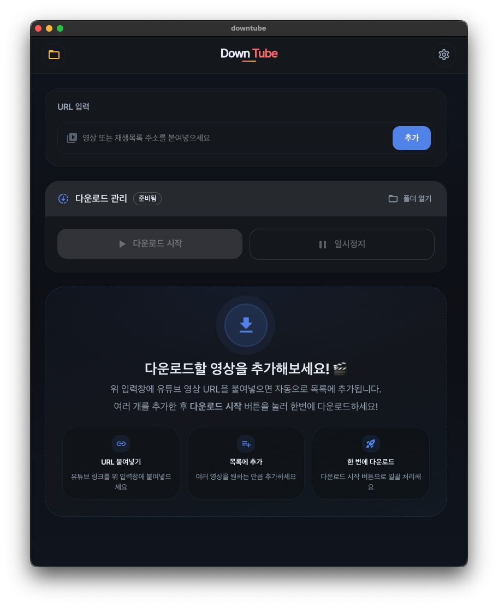

# Downtube

<p align="center">
  
</p>

<p align="center">
  <a href="./LICENSE"></a>
  
  
  
</p>

Electron 기반의 미디어 다운로드 및 로컬 플레이어 데스크톱 앱입니다.  
다운로드 큐 관리, 비디오/오디오 선택, 플레이리스트 일괄 추가, 내장 플레이어, 테마 설정까지 하나의 앱에서 처리할 수 있습니다.

> 공개 라이선스가 있는 미디어, 직접 보유한 콘텐츠, 또는 사용 권한이 있는 콘텐츠를 대상으로 사용하는 것을 전제로 합니다.

---

## 목차

- [주요 기능](#주요-기능)
- [기술 스택](#기술-스택)
- [필수 요구사항](#필수-요구사항)
- [시작하기](#시작하기)
- [빌드](#빌드)
- [프로젝트 구조](#프로젝트-구조)
- [주요 IPC 채널](#주요-ipc-채널)
- [보안 메모](#보안-메모)
- [개발 메모](#개발-메모)
- [라이선스](#라이선스)
- [사용 및 배포 관련 안내](#사용-및-배포-관련-안내)

---

## 주요 기능

- 🎬 최고 화질 비디오 다운로드
- 🎵 오디오 전용 다운로드
- 📋 플레이리스트 항목 일괄 추가
- ⏱️ 큐 기반 다운로드 시작, 일시정지, 중단, 재시도
- 📊 다운로드 진행률 및 상태 표시
- 🎞️ 내장 플레이어로 재생
- 🌗 라이트, 다크, 시스템 테마 지원
- 🔄 yt-dlp 업데이트 확인 및 관리

---

## 기술 스택

| 분류             | 기술                               |
| ---------------- | ---------------------------------- |
| Frontend         | React 19, TypeScript, React Router |
| Desktop          | Electron 35, electron-vite         |
| Media Processing | yt-dlp, FFmpeg, ffprobe            |
| UI               | MUI, Emotion                       |
| State            | Zustand                            |
| Build            | electron-builder                   |

---

## 필수 요구사항

- **Node.js** 18 이상
- **pnpm**
- **운영체제**: Windows 64-bit, macOS, Linux 중 하나
- **yt-dlp**: 실행 환경에 따라 내장 바이너리 또는 사용자가 지정한 경로를 사용할 수 있습니다
- **FFmpeg / ffprobe**: 실행 환경에 따라 내장 바이너리 또는 사용자가 지정한 경로를 사용할 수 있습니다

---

## 시작하기

### 1. 저장소 클론

```bash
git clone <your-repository-url>
cd downtube
```

### 2. 의존성 설치

```bash
pnpm install
```

### 3. 개발 모드 실행

```bash
pnpm dev
```

개발 모드에서는 Electron DevTools가 자동으로 열려 UI와 IPC 흐름을 확인할 수 있습니다.

### 4. 타입 체크

```bash
# 전체
pnpm typecheck

# main process만
pnpm typecheck:node

# renderer process만
pnpm typecheck:web
```

### 5. 린트 및 포맷

```bash
pnpm lint
pnpm format
```

---

## 빌드

### 번들 빌드

```bash
pnpm build
```

### 플랫폼 패키징

```bash
# Windows
pnpm build:win

# macOS
pnpm build:mac
```

`scripts/build-tools/` 아래 스크립트를 직접 실행하는 방법도 지원합니다.

> **참고**: Linux 패키징 스크립트(`build:linux`)는 현재 `package.json`에 정의되어 있지 않습니다.  
> Linux 빌드가 필요한 경우 `scripts/build-tools/` 내 스크립트를 직접 수정하거나 이슈로 요청해 주세요.

---

## 프로젝트 구조

```text
src/
├── main/                          # Electron main process
│   ├── common/                    # 앱 초기화, 프로토콜 등록
│   ├── downloads/                 # 다운로드 도메인 로직
│   │   ├── adapters/              # yt-dlp, ffmpeg, fs 연동
│   │   ├── application/           # 큐 실행, 중단, orchestration
│   │   ├── shared/                # 다운로드 공용 유틸
│   │   ├── index.ts
│   │   └── types.ts
│   ├── ipc-handlers/              # IPC 핸들러 등록
│   ├── settings/                  # 설정 저장 및 검증
│   └── index.ts
├── preload/                       # 안전한 브릿지 API 노출
├── renderer/
│   ├── app/
│   │   ├── features/
│   │   │   ├── downloads/         # 다운로드 화면 및 컴포넌트
│   │   │   ├── player/            # 플레이어 화면 및 컨트롤
│   │   │   ├── settings/          # 설정 화면 및 상태
│   │   │   └── splash/            # 초기 로딩 화면
│   │   ├── pages/                 # 라우트 단위 페이지
│   │   ├── shared/                # 공용 UI, provider, hook
│   │   ├── styles/                # 전역 스타일
│   │   ├── theme/                 # 앱 테마
│   │   ├── router.tsx
│   │   └── app.tsx
│   ├── assets/
│   └── index.html
├── types/                         # 공용 타입
└── libs/                          # 공용 유틸
```

---

## 주요 IPC 채널

| 채널                | 방향            | 설명                              |
| ------------------- | --------------- | --------------------------------- |
| `download-video`    | renderer → main | 비디오 다운로드 작업 추가         |
| `download-audio`    | renderer → main | 오디오 다운로드 작업 추가         |
| `download-playlist` | renderer → main | 플레이리스트 항목을 큐에 추가     |
| `download-set-type` | renderer → main | 대기 중 작업의 다운로드 타입 변경 |
| `download-stop`     | renderer → main | 실행 중 또는 대기 중 작업 중단    |
| `download-remove`   | renderer → main | 큐에서 작업 제거                  |
| `downloads-list`    | renderer → main | 현재 다운로드 목록 조회           |
| `downloads-start`   | renderer → main | 다운로드 큐 시작 또는 재개        |
| `downloads-pause`   | renderer → main | 다운로드 큐 일시정지              |
| `downloads:event`   | main → renderer | 다운로드 이벤트 스트림 구독       |
| `download-player`   | renderer → main | 플레이어 창 열기                  |
| `download-dir-open` | renderer → main | 다운로드 폴더 열기                |

---

## 보안 메모

- **Sandbox 활성화**: renderer process는 Node.js API에 직접 접근할 수 없습니다
- **Context Isolation**: main world와 isolated world를 분리하여 prototype pollution 등을 방지합니다
- **제한된 IPC**: preload 브릿지(`window.api`)를 통한 허용된 채널만 통신합니다
- **외부 링크 격리**: 앱 내 외부 링크는 시스템 기본 브라우저에서 열립니다
- **비밀값 없음**: 앱 번들 내에 API 키나 민감한 값을 포함하지 않습니다

---

## 개발 메모

### 디렉토리 역할

| 경로                    | 역할                                          |
| ----------------------- | --------------------------------------------- |
| `src/main`              | Electron main process 진입점과 앱 초기화      |
| `src/main/downloads`    | 다운로드 큐, 실행 흐름, yt-dlp 및 ffmpeg 연동 |
| `src/main/ipc-handlers` | preload API와 연결되는 IPC 등록 레이어        |
| `src/preload`           | `window.api` 형태의 안전한 렌더러 브릿지 제공 |
| `src/renderer/app`      | UI 라우팅, 화면, 공용 UI 및 상태 관리         |

---

## 라이선스

이 프로젝트의 소스 코드는 [MIT License](./LICENSE)를 따릅니다.

앱에 포함되거나 함께 사용되는 외부 도구는 각각 별도의 라이선스를 가집니다.

### 포함 또는 사용되는 외부 도구

| 도구    | 라이선스                                           | 링크                                       |
| ------- | -------------------------------------------------- | ------------------------------------------ |
| yt-dlp  | Unlicense                                          | [GitHub](https://github.com/yt-dlp/yt-dlp) |
| FFmpeg  | LGPL-2.1-or-later (빌드 구성에 따라 GPL 계열 가능) | [ffmpeg.org](https://ffmpeg.org)           |
| ffprobe | FFmpeg 프로젝트 구성 요소, FFmpeg 배포 조건 적용   | [ffmpeg.org](https://ffmpeg.org)           |

---

## 사용 및 배포 관련 안내

Downtube는 미디어 다운로드 및 로컬 재생 기능을 제공하지만, 사용자는 다음 사항을 반드시 직접 확인해야 합니다.

- 다운로드 대상 콘텐츠의 저작권 보유 여부 또는 사용 허가 여부
- 사용 중인 플랫폼의 서비스 약관
- 해당 국가 또는 지역의 저작권 및 관련 법규

특히 YouTube 등 플랫폼 콘텐츠를 다운로드할 경우, **저작권 문제**와 **플랫폼 약관 위반 문제**는 별개로 검토해야 합니다.

README의 예시 이미지와 설명은 앱 UI를 소개하기 위한 것이며, 특정 플랫폼 콘텐츠의 자유로운 다운로드 또는 재배포 가능성을 의미하지 않습니다.

본 프로젝트를 사용하여 발생하는 저작권 침해, 서비스 약관 위반, 재배포 분쟁, 상업적 이용 문제에 대한 책임은 전적으로 사용자에게 있습니다. 프로젝트 작성자는 개별 사용 행위에 대해 법적 책임을 부담하지 않습니다.

---

## 기여

이슈와 풀 리퀘스트는 언제든지 환영합니다.  
버그 리포트, 기능 제안, 코드 기여 모두 감사히 받겠습니다.
